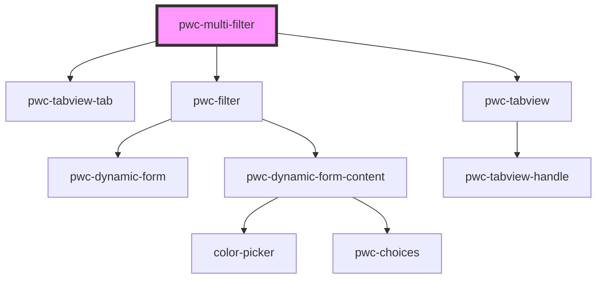

# pwc-multi-filter

<!-- Auto Generated Below -->

## Methods

### `addFilter(config: PwcMultiFilterInterfaces.IFilterTabConfig) => Promise<void>`

#### Returns

Type: `Promise<void>`

### `getFilter(name: string) => Promise<HTMLPwcFilterElement>`

#### Returns

Type: `Promise<HTMLPwcFilterElement>`

### `getFilterResult(name: string) => Promise<object[]>`

#### Returns

Type: `Promise<object[]>`

### `removeFilter(name: string) => Promise<void>`

#### Returns

Type: `Promise<void>`

### `subscribeToFilterChange(name: string, callback: (filterChangedEvent: any) => void) => Promise<void>`

#### Returns

Type: `Promise<void>`

## Dependencies

### Depends on

- pwc-tabview-tab
- pwc-filter
- pwc-tabview

### Graph

----------------------------------------------

*Built with [StencilJS](https://stenciljs.com/)*
